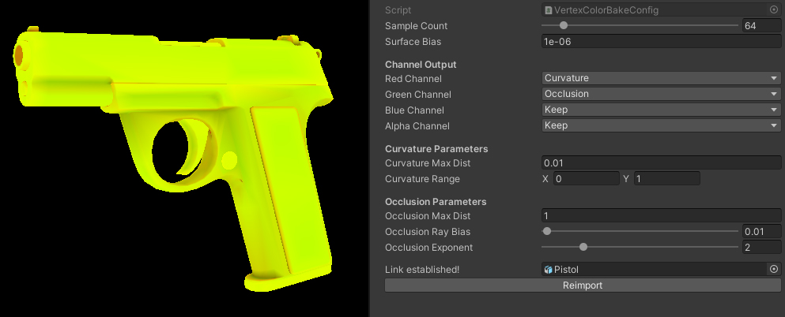
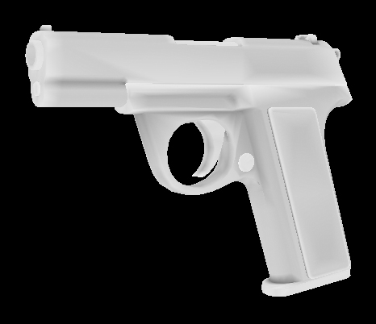
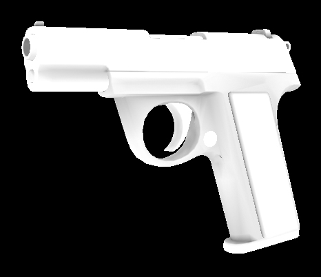

# Vertex Color Baker

# What is this?
An [AssetPostprocessor](https://docs.unity3d.com/ScriptReference/AssetPostprocessor.html) for Unity that can bake ambient occlusion and curvature information into mesh vertex color channels, mainly intended for mid-poly workflows and procedural hard surface shaders.

# How do I use it?
1. Download it and put the contents anywhere in your project.
2. Add a VertexBakeConfig object (Right-click in the project view > *Create > Rendering > Vertex Color Bake Config*) next to an FBX file in your project and give it the same name.
3. Select the VertexBakeConfig object and press the "Reimport" button. This will reimport the FBX which will trigger the bake.

Note that because it is implemented as an AssetPostprocessor, it will automatically rebake if the mesh changes or the project is reimported.

# Bake types

## Curvature

For every vertex, rays are fired inside a sphere and the result is used to approximate the curvature.

## Ambient Occlusion

For every vertex, rays are fired inside a hemisphere and the average of the ray hits determine the final occlusion value.

# Parameters

### Sample Count
The number of rays to use.

### Surface Bias
Offsets the ray origin by the vertex normal. This can help prevent self-occlusion or precision issues.

### Channel Outputs
Determines what bake data goes where.

### Curvature Max Distance
The maximum distance to use when ray casting for curvature.

### Curvature Range
The output value range of the curvature effect. You can use this to remap the curvature data to concave or convex areas only if you wish.

### Occlusion Max Distance
The maximum distance to use when ray casting for ambient occlusion.

### Occlusion Ray Bias
Biases rays in the normal direction. Can help with flat areas receiving too much occlusion.

### Occlusion Exponent
Can be used to darken (higher value than 1) or brighten (lower value than 1) the occlusion effect.
